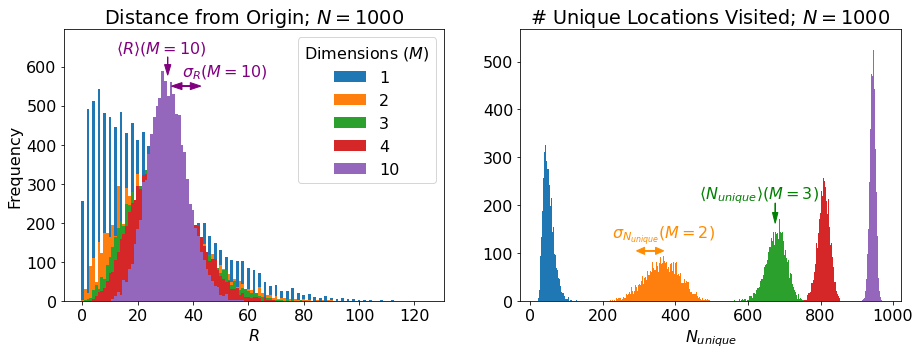
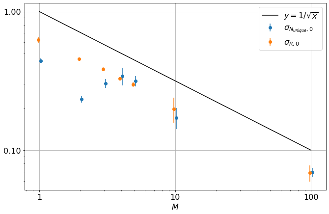

# M-Dimensional Random Walk Stats
The content here is discussed extensively at [efavdb.com/random-walk-scaling](https://efavdb.com/random-walk-scaling).

This explains by example what we're talking about below (some statistics around random walks in M dimensions):

	 

Distributions across various M for a couple N:

 

 

Gif of distributions and their means:

 

Static shots of the distributions and their means:

 

 

 

 

 

 

 

Gif of standard deviations:

 

and the static figures:

 

 

 

 

 

 

 

Exponents and scaling factors vs M:

 

and a log-log for scaling factors of standard deviations vs M:

 

